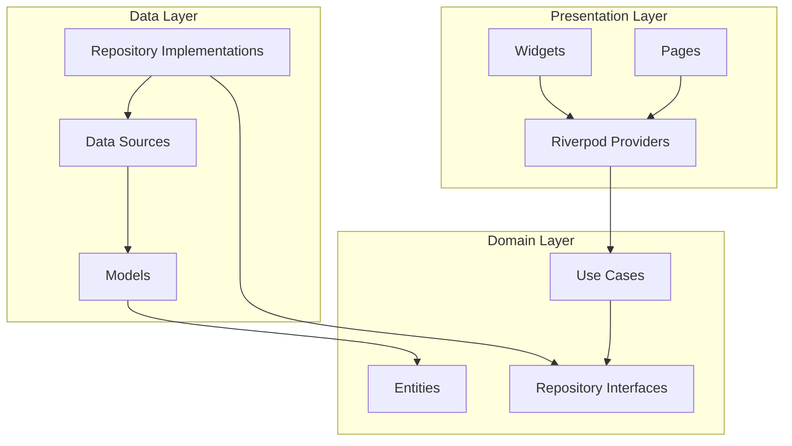
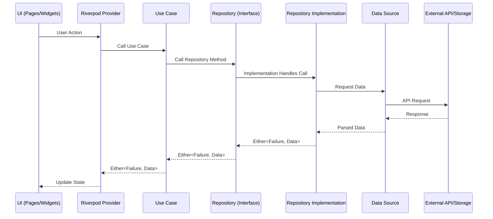
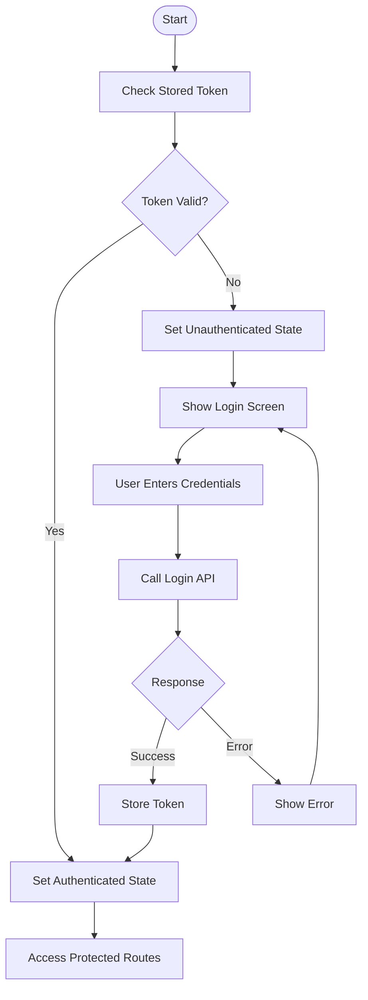
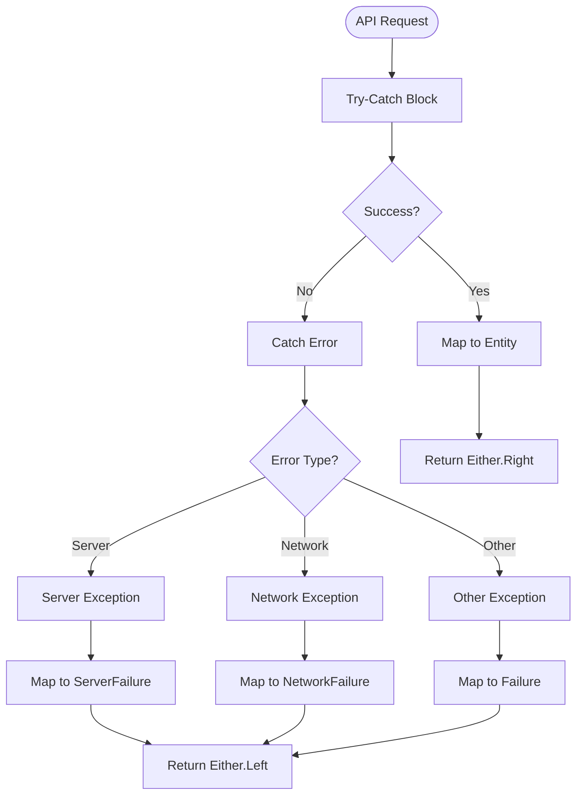
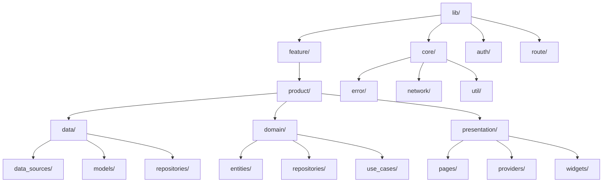
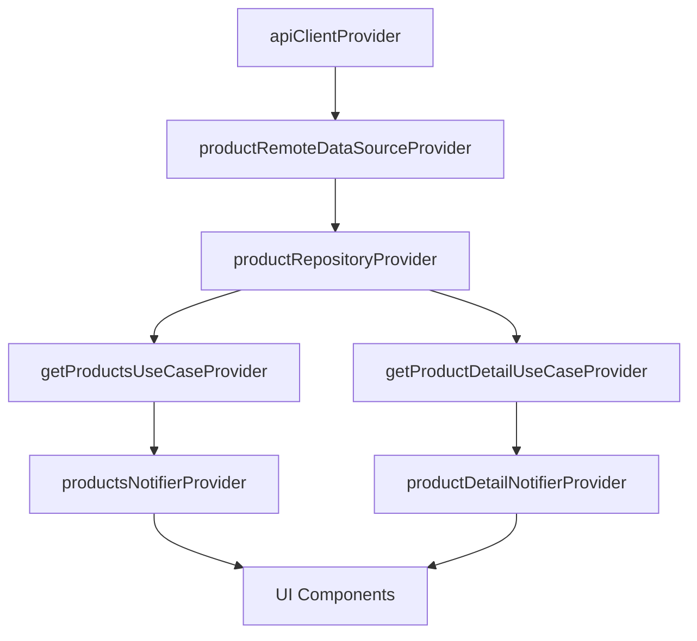

# Clean Architecture Diagrams

## Architecture Overview

The application follows the clean architecture pattern with three main layers:

## Layer Responsibilities

### Presentation Layer

- Contains UI-related code (pages, widgets)
- Uses Riverpod for state management
- Doesn't contain business logic
- Depends on the Domain layer

### Domain Layer

- Contains business logic
- Defines entities (business objects)
- Defines repository interfaces
- Contains use cases (business operations)
- Has no dependencies on other layers

### Data Layer

- Implements repository interfaces from Domain layer
- Manages data sources (API, local storage)
- Handles data mapping between external sources and domain entities
- Depends on the Domain layer for interfaces

## Data Flow

## Authentication Flow

## Error Handling Flow

## Directory Structure

## Dependency Injection with Riverpod

