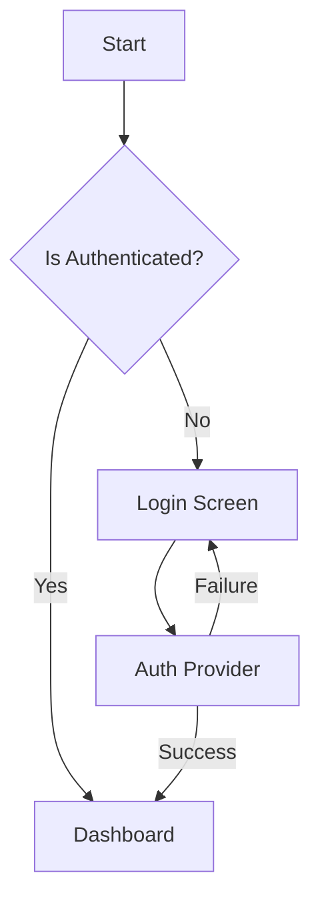
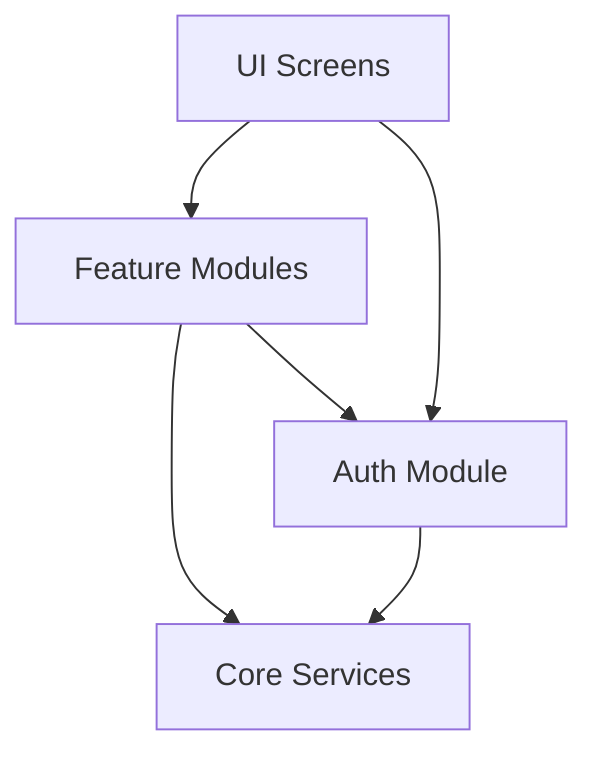
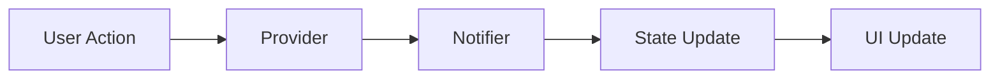

# Flow Diagrams

## Authentication Flow

```mermaid
graph TD
    A[Start] --> B{Is Authenticated?}
    B -->|No| C[Login Screen]
    B -->|Yes| D[Dashboard]
    C --> E[Auth Provider]
    E -->|Success| D
    E -->|Failure| C
```

## Data Flow

```mermaid
graph LR
    A[UI Component] --> B[Provider]
    B --> C[Notifier]
    C --> D[API Service]
    D --> C
    C --> B
    B --> A
```

## Module Interaction

```mermaid
graph TD
    A[Auth Module] --> B[Core Services]
    C[Feature Modules] --> B
    C --> A
    D[UI Screens] --> C
    D --> A
```

## State Management Flow

```mermaid
graph LR
    A[User Action] --> B[Provider]
    B --> C[Notifier]
    C --> D[State Update]
    D --> E[UI Update]
```