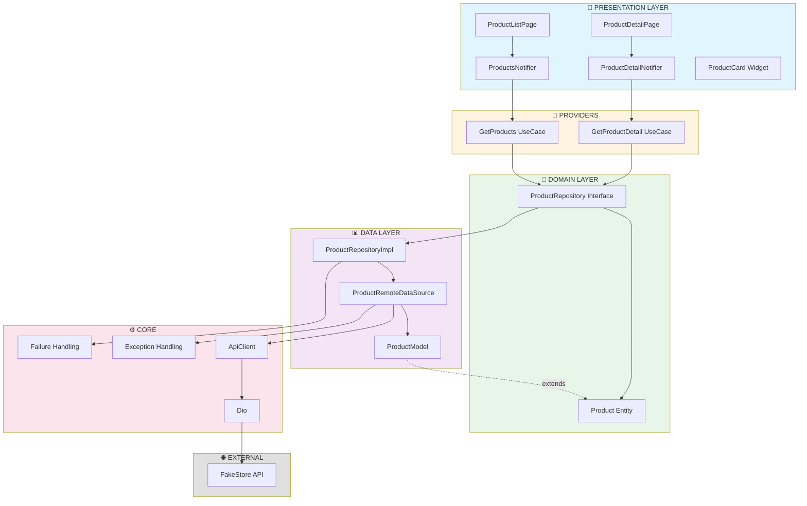
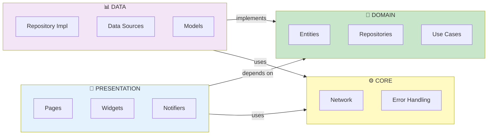
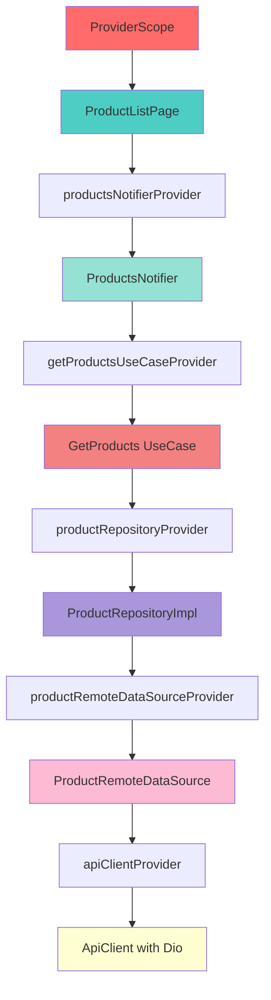
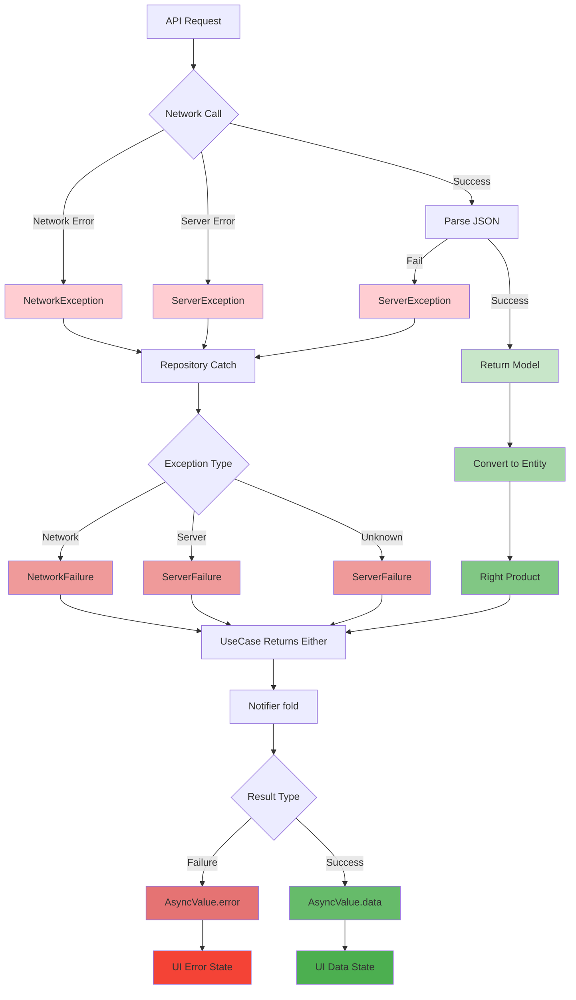
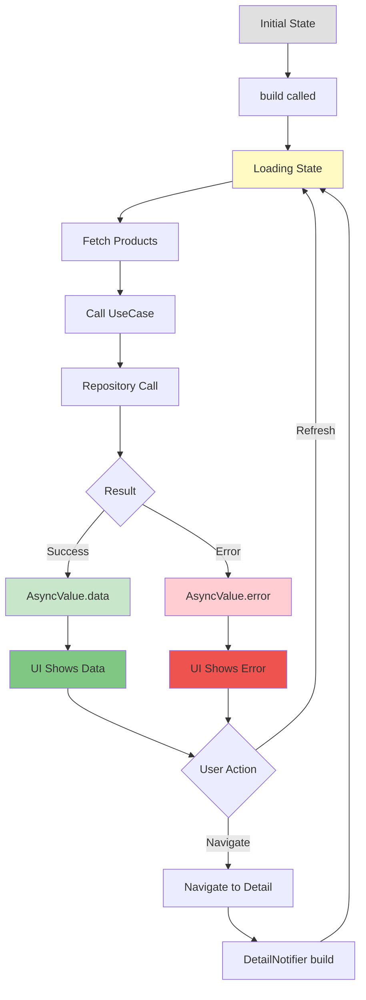
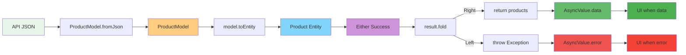
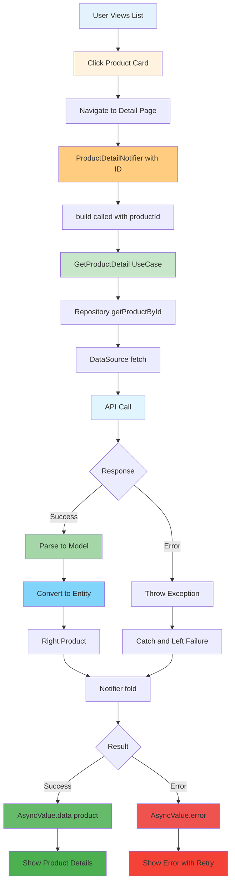
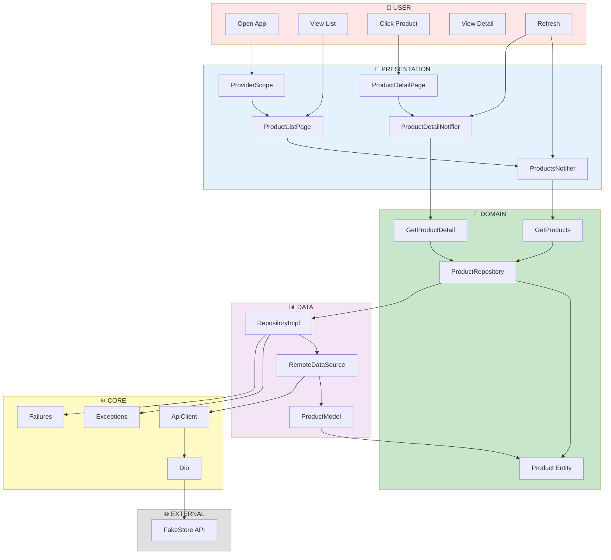

# Clean Architecture với Riverpod - All Diagrams

Tất cả 9 diagrams dạng Mermaid code. Có thể view trên GitHub hoặc các editor hỗ trợ Mermaid.

---

## 📋 1. Clean Architecture Overview

**Mô tả:** Tổng quan về cấu trúc Clean Architecture với các layer: Presentation, Domain, Data và Core.

---

## 🔄 2. Data Flow Diagram

```mermaid
graph LR
    A[👤 User Opens App] --> B[🎨 ProductListPage]
    B --> C[📦 ProductsNotifier]
    C --> D[🎯 GetProducts UseCase]
    D --> E[📚 ProductRepository]
    E --> F[💾 RemoteDataSource]
    F --> G[🌐 ApiClient]
    G --> H[☁️ FakeStore API]
    
    H -.JSON Response.-> G
    G -.Response.-> F
    F -.ProductModel.-> E
    E -.Product Entity.-> D
    D -.Either Result.-> C
    C -.AsyncValue.-> B
    B -.UI Render.-> A

    style A fill:#ffe6e6
    style B fill:#e3f2fd
    style C fill:#fff3e0
    style D fill:#e8f5e9
    style E fill:#f3e5f5
    style F fill:#fce4ec
    style G fill:#e1f5fe
    style H fill:#e0e0e0
```

**Mô tả:** Luồng dữ liệu từ User đến API và ngược lại, bao gồm tất cả các bước chuyển đổi.

---

## 🏛️ 3. Layer Architecture Details

**Mô tả:** Chi tiết cấu trúc từng layer và dependency giữa chúng theo Dependency Rule.

---

## 💉 4. Dependency Injection Flow

**Mô tả:** Cách Riverpod inject dependencies tự động thông qua các Providers từ top-down.

---

## ⚠️ 5. Error Handling Flow

**Mô tả:** Xử lý lỗi từ API đến UI qua các Exception và Failure, sử dụng Either pattern.

---

## 📊 6. State Management - AsyncNotifier Lifecycle

**Mô tả:** Vòng đời của AsyncNotifier từ Initial đến Loading, Data hoặc Error, bao gồm user actions.

---

## 🔀 7. Data Transformation Process

**Mô tả:** Chuyển đổi dữ liệu từ JSON → Model → Entity → Either → AsyncValue → UI.

---

## 📄 8. Product Detail Flow

**Mô tả:** Luồng xử lý khi user click vào product để xem chi tiết, sử dụng Family Provider.

---

## 🎯 9. Complete System Architecture

**Mô tả:** Tổng quan toàn bộ hệ thống với tất cả components từ User đến External API.

---

## 📝 Cách sử dụng:

### 1. View trên GitHub
- Tạo repository mới trên GitHub
- Upload file này
- GitHub sẽ tự động render Mermaid diagrams

### 2. View với VSCode
- Cài extension: **Markdown Preview Mermaid Support**
- Mở file này
- Nhấn `Ctrl+Shift+V` để preview

### 3. View với Obsidian
- Copy file vào vault
- Obsidian hỗ trợ Mermaid native

### 4. Export sang PNG/SVG
- Dùng online tools:
  - https://mermaid.live/
  - https://mermaid.ink/
- Copy code từng diagram
- Export theo format mong muốn

### 5. Import vào Draw.io
- Mở https://app.diagrams.net/
- Insert → Advanced → Mermaid
- Paste code và convert

---

## 🎯 Key Points

- **Clean Separation**: Mỗi layer có trách nhiệm riêng
- **Dependency Rule**: Inner layers không phụ thuộc outer layers  
- **Testability**: Dễ dàng test từng layer độc lập
- **Type Safety**: Sử dụng Either<Failure, T> cho error handling
- **Reactive State**: AsyncNotifier tự động quản lý loading/error/data states

---

**© 2025 Clean Architecture với Riverpod - Flutter Demo**